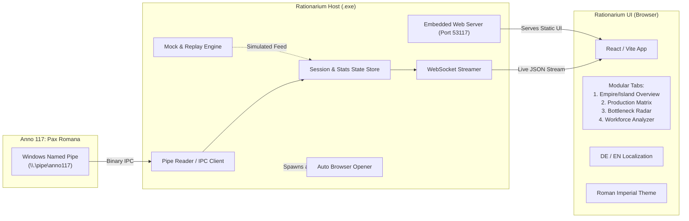

# Rationarium – Design- & Architekturdokument 🏛️

> **Das kaiserliche Rechenbuch für Anno 117: Pax Romana**  
> *Echtzeit-Statistik-, Bilanz- und Companion-Dashboard für den zweiten Bildschirm.*

---

## 1. Projektübersicht & Referenzen

### 1.1 Repositorien & Quellen
* **Projekt-Repository:** [https://github.com/AntaresTerran/Rationarium](https://github.com/AntaresTerran/Rationarium)
* **Offizielle Ubisoft Mainz Referenz:** [https://github.com/UbisoftMainzAnno/anno117_pipe_example](https://github.com/UbisoftMainzAnno/anno117_pipe_example)
* **Community Connector & Replay-Daten:** [https://github.com/anno-mods/anno117-game-connector](https://github.com/anno-mods/anno117-game-connector)
* **Community Rechner & Schema-Definitionen:** [https://github.com/anno-mods/anno-117-calculator](https://github.com/anno-mods/anno-117-calculator)

---

## 2. Kernanforderungen & Vision

1. **Second-Screen Dashboard:**
   * Primär für den zweiten PC-Monitor im Browser ausgelegt (optimiert für 1080p / 1440p / 4K).
   * Dank Web-Technologie auch auf Tablets (z. B. iPad, Android-Tablet) im lokalen Netzwerk nutzbar.
   * Modulare Seiten und anpassbare Tabs (Views), damit Spieler blitzschnell zwischen Inseln, Gesamtreich, kritischen Engpässen und Bauplänen wechseln können.

2. **Zero-Configuration Standalone `.exe` (Wichtig):**
   * Für Endnutzer muss die Anwendung als **einzelne ausführbare Datei (`Rationarium.exe`)** bereitgestellt werden.
   * **Keine** Vorinstallation von Node.js, Python, Visual Studio oder Build-Tools erforderlich.
   * **Start-Verhalten:** Doppelklick auf die `.exe` startet den integrierten lokalen Dienst und öffnet automatisch den Standard-Webbrowser unter `http://localhost:53117`.

3. **Optischer Stil:**
   * Authentischer *Anno 117: Pax Romana*-Stil: Antikes Rom, dunkler Marmor, kaiserliches Purpur/Karminrot, edle Gold- und Bronze-Akzente, klare moderne Typografie.
   * Schnelle Lesbarkeit: Ampel-Indikatoren (Grün = Überschuss, Gelb = Warnung/Knapp, Rot = Defizit).

4. **Asset- & Copyright-Integrität:**
   * Keine urheberrechtlich geschützten Spieldateien oder Texturen im Repository bündeln.
   * Eingebaute, lizenzfreie Vektor-Icons (SVG / Lucide Icons / Game-Icons) als eleganter Standard.
   * *Optionaler Asset-Loader:* Option, Spieldateien lokal aus der Anno 117 Installation des Nutzers auszulesen, falls vorhanden.

5. **Sprachunterstützung (i18n):**
   * Primärsprache: Deutsch (DE).
   * Umschaltbar auf Englisch (EN) und erweiterbar für weitere Sprachen.

6. **Integrierte Test- & Simulationsumgebung:**
   * Vollständiger Pipe-Mock- und Replay-Server (basierend auf echten Mitschnitten aus `test-replay-data.jsonl`).
   * Ermöglicht vollwertiges Entwickeln und Testen ohne laufendes Spiel.

---

## 3. Die Anno 117 Named-Pipe-Schnittstelle

### 3.1 Aktivierung im Spiel
Anno 117 stellt die Daten über eine Windows Named Pipe bereit. Dies muss beim Spielstart via Launch-Argument aktiviert werden:
* **Ubisoft Connect:** Spiel-Eigenschaften -> Startargumente -> `/pipe` eintragen und speichern.

### 3.2 Schnittstellen-Parameter
* **Pipe-Pfad:** `\\.\pipe\anno117`
* **Protokoll-Version:** `2` (Stand: Release des Beispiels)
* **Preamble beim Verbindungsaufbau:**
  1. 4 Bytes: Nachrichtenlänge `size` (Little Endian `int32`)
  2. 1 Byte: Nachrichtentyp `Message::Version` (`0`)
  3. 4 Bytes: Protokollversion (`int32`, aktuell `2`)

### 3.3 Nachrichten-Typen (`enum class Message : uint8_t`)
| ID | Name | Beschreibung |
|---|---|---|
| `0` | `Version` | Versionsabgleich beim Handshake |
| `1` | `SessionStart` | Beginn einer Spielsitzung; gefolgt von Sitzungsname |
| `2` | `SessionEnd` | Ende der Sitzung; Cache leeren |
| `3` | `AreaProductionStatistics` | Regelmäßiger Stream der Produktionsdaten für ein Gebiet/Insel |

### 3.4 Datenstruktur `AreaProductionStatistics`
```
[int32 message_length]
[uint8 message_type = 3]
[uint8 sessionID]
[uint8 islandID]
[uint8 areaIndex]
[int32 sessionGUID]
[string areaName]       // 1 Byte Länge + UTF-8 Zeichen
[int64 timeStamp]
[int32 numEntries]
// Wiederhole numEntries-mal:
  [int32 ProductGuid]
  [float ProductGeneration]
  [float ProductConsumption]
  [float ProductDelta]
  [float PerfectProductGeneration]
  [float PerfectProductConsumption]
  [int32 AmountOfBuildings]
  [int32 TotalMaintenance]
  [float TotalIncome]
  [int32 TotalProfit]
  [float SummedProductivity]
  [float AverageProductivity]
  [int32 numWorkforces]
    -> numWorkforces * [int32 workforceGUID, int32 amount]
  [int32 numBuildings]
    -> numBuildings * [int32 buildingGUID, int32 amount]
```

> [!IMPORTANT]
> **Eindeutige Insel-Identifikation:**  
> Wie im `anno117-game-connector` dokumentiert, sind `islandID` und `areaIndex` allein **nicht** sitzungsübergreifend eindeutig. `islandID` wiederholt sich über verschiedene Sessions/Regionen. Jeder State-Key für Inseln muss zusammengesetzt werden aus:
> `Key = ${sessionGUID}_${islandID}` bzw. `Key = ${sessionId}_${islandID}`.

---

## 4. Systemarchitektur & Technologie-Stack



### 4.1 Frontend-Stack
* **Framework:** React 18 / 19 mit TypeScript
* **Build-Tool:** Vite (schnelle Builds, kleiner Footprint)
* **Styling:** Tailwind CSS mit individuellem Römischen Theme (Custom Color Palette: Imperial Crimson, Roman Gold, Marble Stone, Olive Leaf, Deep Slate)
* **Komponenten:** Modulare Tabs, flexible Grid-Karten, sortierbare & filterbare Tabellen
* **Charts/Graphen:** Recharts oder Chart.js für Verlaufs- und Trendkurven
* **Icons:** Lucide-React / Game-Icons SVG

### 4.2 Backend-Stack & Pipe-Connector
* **Laufzeit:** Node.js (TypeScript)
* **Pipe-Kommunikation:** Nativer Windows Named Pipe Support über Node `net.Socket` (`net.connect(R'\\.\pipe\anno117')`)
* **HTTP & WebSocket:** Schlanker HTTP-Server (Fastify / Polka / Express) + `ws` (WebSockets)
* **Browser-Launcher:** `open` npm-Package (öffnet automatisch `http://localhost:53117` im Standardbrowser)

### 4.3 Standalone-Packaging (`.exe`)
Um dem Anwender eine Zero-Installations-Erfahrung zu bieten:
1. **Frontend-Build:** Vite erzeugt optimierte statische Dateien in `dist/`.
2. **Backend-Bundle:** `esbuild` bündelt das gesamte Backend inklusive statischer Assets in eine Datei.
3. **Executable-Generierung:** 
   * Primäre Option: **Node SEA (Single Executable Application)** oder **`pkg`**, wodurch eine eigenständige `Rationarium.exe` (ohne externe Node-Abhängigkeit) entsteht.
   * Alternative: Ein kompakter Wrapper / Launcher.

---

## 5. Geplante Features & Benutzeroberfläche

### 5.1 Modulare Ansichten (Tabs)

#### Tab 1: Reichs- & Inselübersicht (*Conspectus Provinciarum*)
* Übersicht aller bekannten Inseln und Provinzen (Latium, Albion etc.).
* Schnellauswahl der aktiven Insel oder Aggregation des gesamten Reichs (*Omnes Insulae*).
* Status-Karten mit Kernwerten: Gesamtgewinn/Verlust, Gesamtarbeitskraft, Anzahl kritischer Engpässe.

#### Tab 2: Produktions- & Bilanzmatrix (*Rationarium Bonorum*)
* Alle Waren geordnet nach Kategorien (Grundnahrung, Genussmittel, Baumaterialien, Militär, Luxus).
* Live-Anzeige:
  * **Produktion (Aktuell vs. 100% Potenzial)**
  * **Verbrauch (Aktuell vs. 100% Bedarf)**
  * **Netto-Delta (Überschuss / Defizit)** mit optischem Farbsystem
  * **Betriebsanzahl & Durchschnittliche Produktivität**
* Suchleiste & Schnellfilter (z. B. „Nur Defizite anzeigen“, „Kategorie: Nahrung“).

#### Tab 3: Engpass- & Frühwarn-Radar (*Specula & Alarmae*)
* Automatische Erkennung kritischer Güter mit negativem Delta.
* Berechnung der voraussichtlichen Zeit bis zum Lagerleerstand (falls Lagerbestandsdaten ergänzt werden).
* Optische und dezente akustische Signale bei Versorgungszusammenbrüchen von Grundbedürfnissen.

#### Tab 4: Arbeitskraft- & Betriebsanalyse (*Operarii & Fabricae*)
* Detaillierte Aufschlüsselung der benötigten Arbeitskräfte pro Stufe (Plebejer, Patrizier etc.).
* Liste ineffizienter oder pausierter Betriebe (Produktivität < 100%).

#### Tab 5: Einstellungen & Simulation (*Configurationes*)
* Umschalten zwischen **Echtzeit-Spielverbindung** und **Simulations-/Testmodus** (Replay-Dateien).
* Sprachauswahl: Deutsch / English.
* Theme-Einstellungen und Port-Konfiguration.

---

## 6. Projektstruktur im Repository

```
Rationarium/
├── README.md                      # Projektübersicht für Nutzer & GitHub
├── DESIGN.md                      # Dieses Dokument (Architektur & Konzept)
├── .gitignore                     # Git-Ausschlüsse
├── data/
│   ├── guid_mappings_de.json     # Zuordnung GUID -> Name / Kategorie (Deutsch)
│   ├── guid_mappings_en.json     # Zuordnung GUID -> Name / Kategorie (Englisch)
│   └── samples/
│       └── replay_sample.jsonl   # Test-Replay-Daten für Simulation
├── src/
│   ├── shared/                    # Geteilte Typen & Konstanten
│   │   ├── protocol.ts            # Binärprotokoll-Definitionen & Enums
│   │   └── types.ts               # Datenmodelle für Inseln & Statistiken
│   ├── server/                    # Backend (.exe Host)
│   │   ├── index.ts               # Haupteinstiegspunkt
│   │   ├── pipe-client.ts         # Named-Pipe-Connector & Binärparser
│   │   ├── mock-server.ts         # Replay-Engine für Offline-Tests
│   │   ├── state-manager.ts       # Aggregation & Session-Caching
│   │   └── web-server.ts          # HTTP- & WebSocket-Server
│   └── client/                    # Frontend (React + Vite)
│       ├── index.html
│       ├── vite.config.ts
│       ├── tailwind.config.js
│       └── src/
│           ├── components/        # Header, Tab-Navigation, Cards, Tables
│           ├── views/             # Einzelne Tabs (Overview, Production, etc.)
│           ├── hooks/             # WebSocket-Hooks für Live-Daten
│           ├── i18n/              # Übersetzungen (DE / EN)
│           └── assets/            # Römische Design-Assets & Icons
└── scripts/
    ├── build.ps1                  # PowerShell Build-Script für Frontend & Backend
    └── package-exe.ps1            # Erzeugt die fertige Standalone Rationarium.exe
```

---

## 7. Leitfaden für Mitwirkende & KI-Agenten

1. **Named Pipe Protokoll-Sicherheit:**
   * Leseoperationen aus der Pipe müssen immer Längenprüfungen durchführen (`message_length` prüfen), um Pufferüberläufe und Crashes bei unvollständigen Paketen zu verhindern.
   * `sessionGUID` + `islandID` als Primärschlüssel verwenden.
2. **Replay-First Development:**
   * Neue Features und UI-Komponenten immer zuerst gegen den `mock-server` mit echten `jsonl`-Testdaten testen, damit Entwickler und Tester kein laufendes Anno 117 benötigen.
3. **Executable-Build:**
   * Jeder Release-Build muss verifizieren, dass die resultierende `.exe` in einer sauberen Umgebung ohne installierte Entwicklungswerkzeuge lauffähig ist.
